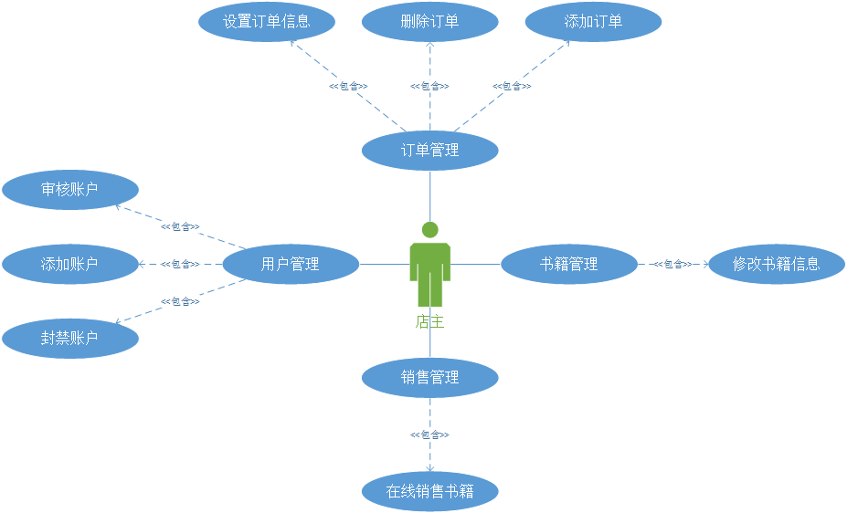
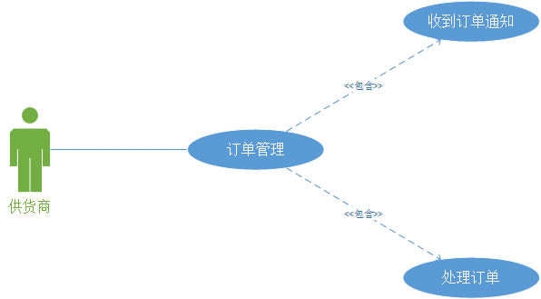
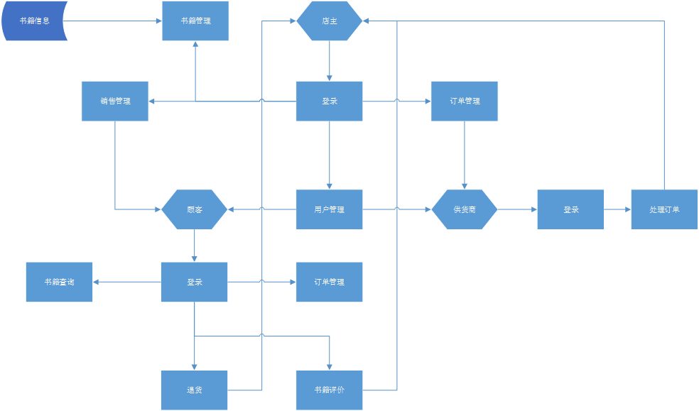

# 
 书店管理系统需求分析报告  

#### Homework2:案例设计

Link:[案例设计报告](https://github.com/isph/OO/blob/master/Docs/%E5%9B%BE%E4%B9%A6%E9%A6%86%E7%AE%A1%E7%90%86%E7%B3%BB%E7%BB%9F%E9%9C%80%E6%B1%82%E5%88%86%E6%9E%90%E7%AC%AC1%E8%BD%AE.pdf)

#### Homework3:业务目标与涉众分析

Link:[业务目标与涉众分析报告](https://github.com/isph/OO/blob/master/Docs/%5B%E4%BD%9C%E4%B8%9A3%5D%E4%B9%A6%E5%BA%97%E7%AE%A1%E7%90%86%E7%B3%BB%E7%BB%9F%E6%B6%89%E4%BC%97%E5%88%86%E6%9E%90%E6%8A%A5%E5%91%8A.pdf)

## 1. 引言

### 1.1 编写目的
本文档编写目的是为书店管理系统项目开发提供需求分析规格说明, 主要有以下几条:

- 软件总体要求, 本文档作为用户与软件开发人员之间相互了解的基础;

- 功能,性能,接口和可靠性的要求, 作为软件人员进行设计和编码的基础;

- 验收标准, 作为用户客户确认测试的依据.

### 1.2 文档约定

1. 文档的描述内容是书店管理系统的需求分析说明书;

2. 文档的功能需求列表参照双方共同认可的报价列表内容;

3. 文档采用基于UML建模语言的面向对象建模方式对功能需求进行描述;

4. 需要描述的功能需求都有对应的用况;

5. 针对某一特定角色的功能都由下面三项内容进行需求内容的详细说明：

    - 用况图: 一个图可以包含多个基本用况, 每个基本用况也可以具有多个扩展和包含类型的子用况;
    
    - 用况说明: 描述主要基本用况和子用况的详细说明;
    
    - 系统流程图: 只针对基本用况进行UML图形化描述; 基本用况具有扩展和包含用况的，绘制一张系统流程图.

6. 性能需求以文字和列表的方式具体给出.

### 1.3 预期的读者和阅读建议

|编号|预期读者|阅读建议|
|----|:------:|:---------------------------:|
|1   |客户    |确认文档中给出的功能需求描述|
|2   |开发方  |熟悉并掌握项目的共享功能需求|

## 2. 项目概述

### 2.1 项目背景
随着信息科技及互联网产业的迅速发展, 现代化社会中各行各业产生激烈的竞争, 如何提高工作效率, 降低成本, 提高生产及交易过程的现代化和自动化程度, 充分满足生产者和消费者的需求, 提供更优质的服务成为各行各业追逐的目标, 对于传统书店来说, 整个交易流程自动化程度很低, 难以满足日益增长的物质文化需求, 因此开发一套方便快捷, 高效实用且安全稳定的书店管理系统成为了传统书店的当务之急, 书店店主需要开发一套满足相关需求的书店管理系统.

### 2.2 项目目标
- 加强书籍管理, 提高整体工作效率, 通过书店管理系统实现对书籍管理和交易过程的信息化.
- 为书店店主, 供货商和消费者提供在线信息交流和交易的平台.

### 2.3 运行环境

系统运行环境要求:

|编号|名称        |运行环境|
|----|:----------:|:-------:|
|1   |应用服务器  |Windows  |
|2   |Web服务器   |待定  |
|3   |数据库      |待定   |
|4   |并行计算平台|Hadoop |
|5   |客户端      |Chrome浏览器|

### 2.4 设计和实现上的限制

|限制因素                                     |限制说明     |备注|
|---------------------------------------------|:-----------:|:---:|
|必须采用的技术/工具/编程语言/数据库等        |无特殊限制   |    |
|不能使用的技术/工具/编程语言/数据库等        |无特殊限制   |    |
|企业策略/政策法规/业界标准                   |必须遵守中华人民共和国相关法律法规             |    |
|硬件限制                                     |无特殊限制             |    |
|性能限制                                     |无特殊限制             |    |

### 2.5 假定和依赖
定义各子系统运行和开发中可能的假定条件和依赖因素如下:
表格-假设因素

| 编号        | 假设           | 备注  |
| ------------- |:-------------:|:-----:|
| 1      | 客户端操作系统使用Chrome浏览器 |  |
| 2      | 对现有业务/功能描述与实际情况基本符合, 对需求的变更不影响系统框架大的调整      |    |

表格-依赖因素

|编号|依赖     |依赖说明| 备注 |
|----|:-------:|:-------:|:-----:|
|1   | 数据库  |业务数据存储在数据库中   |      |
|2   | 运行平台  |系统运行依赖于特定的系统平台 |      |

## 3. 系统需求分析

### 3.1 项目名称
##### 书店管理系统

### 3.2 需求概述

书店管理系统需要满足如下需求:

##### 店长

1. 书籍管理: 店长可以管理书籍相关的信息.

    - 书籍的管理操作包括书籍信息的添、删、查、改.

    - 书籍信息包括书名、作者、存货量、销售量、进价、销售价格等.

2. 订单管理:店长可以管理书籍订单.

    - 订单的管理操作包括订单的添加与删除.

    - 订单信息包括书名、需求数量等.

    - 店长发布订单时即可以固定进货价格，也可以选择由供货商竞价.

    - 当店长发布订单后，所有供货商将收到通知.

    - 对于固定进货价格的订单，当订单被供货商接受后，店长会收到通知，且书籍信息中相应书籍的存货量会相应增加。若订单被所有供货商拒绝，该订单将被撤销且店长会收到通知.

    - 对于供货商竞价的订单，店长还将设置订单有效时间。当到达订单有效时间后，出价最低的供货商将获得该订单。若无供货商出价，该订单将被撤销且店长会收到通知.

3. 用户管理:店长可以管理顾客与供货商的账户.

    - 账户类型包括店长、顾客和供货商三类.

    - 顾客与供货商可以注册账户，需要通过店长的审核。店长也可以在后台手动添加账户.

    - 顾客与供货商可以注销账户，店长也可以在后台封禁账户.

4. 销售管理:店长可以在线销售书籍.

    - 店长可以选择在线销售的书籍以及销售价格.

    - 店长可以根据书店销售情况调整销售策略，如限时折扣、捆绑销售等.

##### 顾客

1. 书籍查询:顾客可以查询自己需要的书籍.

    - 支持按名字、书号、类别、关键字、销量等方式查询.

    - 能查询到的信息包括书籍的基本信息、价格、是否有货、评论等.

    - 对查询到的书籍，顾客能够收藏自己感兴趣的书籍.

    - 系统能自动记录顾客的浏览历史.

2. 书籍购买:顾客可以购买所需要的书籍, 并自动创建订单.

    - 支持填写收货信息，包括地址、姓名、电话等.

    - 支持在线支付，包括银行卡、微信、支付宝等多种支付方式；支持货到付款.

    - 用户提供发票抬头等信息后，就能在线开具发票.

3. 订单管理:顾客可以查看订单的状态, 可以自主取消订单.
 
    - 包括订单的支付状态，已支付、未支付等.

    - 支持查询书籍的到货情况，支持查询书籍的预计达到时间、当前书籍位置等.

    - 在未发货时顾客可以选择取消订单，系统自动退款；若已经发货，则顾客只能选择退货.

4. 退货: 当顾客对到手的书籍不满意时, 可以申请退货.

    - 顾客可以在线申请退货，需填写退款原因；待店长批准之后，顾客可以将要退的书按指定地址寄出.

    - 店长收到顾客的退货之后，系统自动给顾客退款.

5. 书籍评价: 顾客收到书籍后, 可以对书籍做出评价, 反馈自己的意见或建议.

    - 评价具体包括对书籍、购买过程、快递等的按星级评价.

    - 支持文字性的评论；支持附加图片.

    - 支持追加评价.

##### 供货商
1. 订单管理: 供货商可以对店长发布的订单进行处理.

    - 当书店发布订单时供货商会接到通知.

    - 对于固定进货价格的订单，供货商可以选择接受或拒绝.

    - 对于竞价的订单，供货商可以看到其他供货商所出的最低价，并可以选择出更低的价格.当订单有效时间到达后，所有参与出价的供货商均会收到竞价是否成功的通知.

#### 3.3 功能需求

业务功能需求如下:

店主业务功能需求模块划分:

1. 书籍管理
2. 订单管理
3. 用户管理
4. 销售管理

顾客业务功能需求模块划分:

1. 书籍查询
2. 书籍购买
3. 订单管理
4. 退货
5. 书籍评价

供货商业务功能需求模块划分:

1. 订单管理

#### 3.4 用况图

根据甲方提出的需求, 系统的主要参与者为店主/顾客/供货商, 从参与者角度可以提取出系统的主要用况, 并绘制出系统的用况图如下所示:

***

***

***

***

#### 3.5 主要用况说明

***
用况编号: UC_01_01
用况名称: 在线销售书籍
范围: 书店管理系统
级别: 用户目标
主要参与人: 店主
前置条件: 顾客登录系统发出订单且书店中有该书籍
主要成功场景:

* 用户确认收到书籍.

***

用况编号: UC_01_02
用况名称: 修改书籍信息
范围: 书店管理系统
级别: 用户目标
主要参与人: 店主
前置条件: 店主登录系统
主要成功场景:

* 新的书籍信息被添加并存储.
* 书籍信息改变并存储在系统中.

***
用况编号: UC_02_01
用况名称: 书籍购买
范围: 书店管理系统
级别: 用户目标
主要参与人: 顾客
前置条件: 用户登录系统在线支付所需书籍订单
主要成功场景:

* 用户确认收到书籍.

***

用况编号: UC_02_02
用况名称: 查询书籍信息
范围: 书店管理系统
级别: 用户目标
主要参与人: 顾客
前置条件: 顾客登录系统并查询书籍信息
主要成功场景:

* 系统返回相关书籍信息给用户.

***
用况编号: UC_03_01
用况名称: 处理订单
范围: 书店管理系统
级别: 用户目标
主要参与人: 供货商
前置条件: 店主发出订单, 供货商登录系统且收到通知
主要成功场景:

* 供货商接受订单并发出货物.
* 供货商拒绝订单.

***

#### 3.6 角色定义

角色名称: 店主
角色职责: 

* 及时更新书店书籍信息.
* 及时处理顾客和供货商的订单.
* 管理顾客和供货商账户.
* 在线销售书籍并发货.

角色名称: 顾客
角色职责:

* 寻找自己需要的书籍.
* 在线付款并处理自己的订单.
* 确认收货并给出评价.

角色名称: 供货商
角色职责:

* 及时处理书店店主订单.
* 按订单要求为书店发货.

#### 3.7 系统流程图

针对甲方提出的需求进行分析, 可以了解甲方的业务流程从而对应到系统的工作流程, 通过对系统流程的讨论和梳理, 绘制系统工作流程图如下:

***

***

## 4. 其他非功能性需求

#### 可靠性需求

系统应当具有必要的可靠性使得系统能够较长时间无故障运行.

#### 可扩展性需求

系统应当具有必要的灵活性, 以适应未来功能扩展的需求.

#### 性能需求

* 响应时间: 用户在浏览器端操作将在3秒钟之内得到响应.
